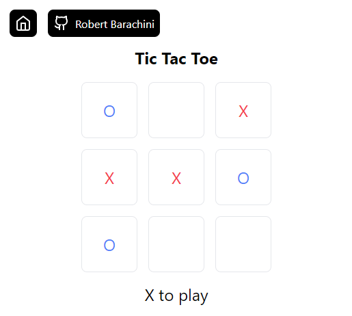

# Tic-tac-toe

<p align="center">
	
</p>

A state of the art Tic-tac-toe implementation in pure HTML.

# About the project

This is a meme project that I created one afternoon after being fed up with DevOps at work.

You can play the game online by visiting https://robertbarachini.github.io/projects/tic-tac-toe/

If you want to play it offline you can do so by downloading the `./src/site` folder and opening `index.html` in your browser.

# Some stats

Generated with `tictactoe.py`:

```text
Tree function visits: 294778
Unique states/boards: 5477 (5478 with empty board)

Stats:
> X wins: 131184
> O wins: 77904
> Ties: 46080
> Unique X wins: 626
> Unique O wins: 316
> Unique Ties: 16

Tied boards:

Tie 1:
X | O | X
--+---+--
O | X | X
--+---+--
O | X | O

Tie 2:
X | O | X
--+---+--
O | O | X
--+---+--
X | X | O

Tie 3:
X | O | X
--+---+--
X | O | O
--+---+--
O | X | X

Tie 4:
X | O | X
--+---+--
X | O | X
--+---+--
O | X | O

Tie 5:
X | O | X
--+---+--
X | X | O
--+---+--
O | X | O

Tie 6:
X | O | O
--+---+--
O | X | X
--+---+--
X | X | O

Tie 7:
X | X | O
--+---+--
O | X | X
--+---+--
X | O | O

Tie 8:
X | X | O
--+---+--
O | O | X
--+---+--
X | O | X

Tie 9:
X | X | O
--+---+--
O | O | X
--+---+--
X | X | O

Tie 10:
O | X | X
--+---+--
X | O | O
--+---+--
X | O | X

Tie 11:
O | X | X
--+---+--
X | O | O
--+---+--
O | X | X

Tie 12:
O | X | X
--+---+--
X | X | O
--+---+--
O | O | X

Tie 13:
O | X | O
--+---+--
X | X | O
--+---+--
X | O | X

Tie 14:
O | X | O
--+---+--
X | O | X
--+---+--
X | O | X

Tie 15:
O | X | O
--+---+--
O | X | X
--+---+--
X | O | X

Tie 16:
O | O | X
--+---+--
X | X | O
--+---+--
O | X | X
```
